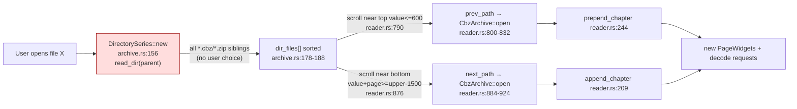
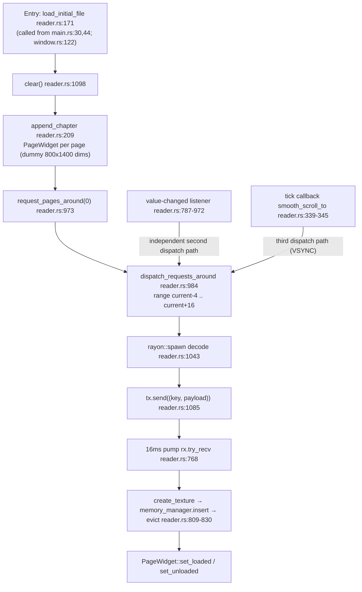

# Knowledge Base Report — Continuum (omarys/continuum)

Stage 03 (Architecture & Threat Model) of piolium deep audit.
Generated: 2026-08-13 | Mode: deep | Phase: P3 | Commit: 4b8bf32e8cb145ddbf880f3b42143560b89746c3
Curated context: **absent** (no `piolium/KNOWLEDGE-BASE.md` / `INFO.md`) — full discovery performed.
Inputs ingested: `sbom.json` (P1), `advisory-summary.md` (P1), `patch-bypass-summary.md` (P2), full source read (13 Rust files, 2,368 LOC), desktop entry, install script, git history (3 commits, 2 branches).

---

## Project Classification

- **Type**: Desktop GUI application (GTK4 / Libadwaita), single-process, local-first. Category: *desktop app*; also *file-format consumer* (ZIP/.cbz + image decoding pipeline). Not a web app, API, CLI (has thin CLI argv[1] entry), library, plugin, protocol, worker, or CI action.
- **Purpose**: Minimal manhwa/webtoon reader. Opens `.cbz`/`.zip` comic archives, lazily decodes pages (PNG/JPEG/WebP/GIF/BMP) on a rayon worker pool, renders GTK textures in a continuous vertical (manhwa) or horizontal (manga) scroller with a 256 MiB–1 GiB in-memory texture cache and automatic sibling-chapter loading (`DirectorySeries`).
- **Language/runtime**: Rust 1.97.1 (edition 2021), release profile `opt-level=3, lto=fat, codegen-units=1, panic=abort, strip`.
- **Deployment**: Installed via `install.sh` → `~/.cargo/bin/continuum`; desktop entry registers MIME `application/x-cbz;application/x-cbr;application/zip` → `Exec=.../continuum %f`. No container, no network, no IPC, no subprocesses, no plugins, no persistence beyond in-memory cache.
- **Repo maturity**: 3 commits, no tags, no tests, no CI workflows; 2nd commit (`4b8bf32`) adds features; `origin/plasma` (`9e5bb2e`) is an unreleased Qt6/QML rewrite (covered separately in Coverage Gaps).

---

## Architecture Model

### Component inventory (verified against source)

| Component | File(s) | Role | Trust role |
|---|---|---|---|
| `libadwaita::Application` | `src/main.rs:9-46` | App lifecycle, `HANDLES_OPEN` signal handling, CLI argv[1] | Entry point (TB1) |
| `ManhwaWindow` | `src/ui/window.rs:17-352` | Window/header bar, FileDialog, keyboard controller, shortcuts dialog | UI control |
| `ReaderView` | `src/ui/reader.rs:100-1123` | Scroll viewport, lazy-load scheduler, decode dispatch, auto chapter load, 60 FPS decode pump, crossbeam channel | **Core attack surface — decode orchestration** |
| `CbzArchive` | `src/cbz/archive.rs:43-147` | ZIP parse, extension allowlist, natord sort, `decode_page_bytes` (image crate), `create_texture` (pixbuf→texture with byte-count check) | **Core attack surface — parser + decoder + texture builder** |
| `DirectorySeries` | `src/cbz/archive.rs:156-207` | Scans parent dir for sibling `.cbz`/`.zip`, natural sort, index of current file | Trust-scope widener (TB2) |
| `MemoryManager` | `src/cache/memory_manager.rs:31-151` | Texture cache, 256 MiB floor / 1 GiB ceiling, distance-based eviction | Resource governor (post-decode only) |
| `PageWidget` | `src/ui/page_widget.rs:31-155` | Per-page picture/spinner/placeholder, mode layout | UI |
| `Chapter banner` | `src/ui/chapter_banner.rs:5-62` | Renders archive filename (file_stem cleaning) | Log/UI injection surface (TB4) |
| `debug_read` (bin) | `src/bin/debug_read.rs:1-52` | Dev-only zip/image probe with hardcoded absolute path | Out of runtime scope |

### Transports / execution environments

- **Primary transport**: local filesystem reads (`File::open`, `read_dir`) — no sockets, no network crates (verified: no reqwest/ureq/hyper/tokio/openssl/rustls in tree), no `std::process`/`Command` call sites, no IPC.
- **Thread boundary**: rayon global pool (decode workers) → `crossbeam_channel::unbounded` (RGBA payload handoff) → GTK main loop (`glib::timeout_add_local` 16 ms pump). GTK widgets are main-loop-only; payloads are `Send` data (`DecodedImagePayload`).
- **Event loop**: GTK signal/`idle`/`timeout`/`tick` callbacks (hidden control channels, see Framework Contracts).
- **Execution environments**: Fedora 44 desktop host; system GTK4 4.22.4, libadwaita 1.9.3, gdk-pixbuf2 2.44.4, libwebp 1.6.0, libpng 1.6.58, libjpeg-turbo 3.1.3; Rust toolchain 1.97.1.

### Trust boundaries

| # | Boundary | From → To | Attacker-controlled data | Controls at boundary |
|---|---|---|---|---|
| TB1 | Untrusted archive → ZIP/image pipeline | Any `.cbz`/`.zip` the user opens (file dialog, CLI argv[1], GTK open, MIME association) → `CbzArchive::open` → image decoders | Entry names, entry sizes (uncompressed/compressed), compression method, compressed bytes, image headers/dimensions/pixels | Extension allowlist (`.jpg/.jpeg/.png/.webp/.gif/.avif/.bmp`, non-dir) at `archive.rs:51-63`; zip crate 2.4.2; image crate `Limits::default()` (512 MiB max alloc) *after* decompression; `create_texture` byte-count equality check `archive.rs:105-113` (fail-closed, post-allocation) |
| TB2 | Directory of opened file → auto-load chain | `DirectorySeries::new` scans `parent()` for **all** `.cbz`/`.zip` siblings (`archive.rs:156-180`); scroll listener auto-opens prev/next (`reader.rs:790-830`, `reader.rs:876-924`) with **no user interaction** | Any writable sibling archive in the same directory | None — by design; every sibling is opened as chapters are reached |
| TB3 | Worker → main loop (memory-safety boundary) | `DecodedImagePayload` (multi-MB `Vec<u8>`) via unbounded crossbeam channel; drop on both worker and main-loop paths | Payload shape (allocated in worker from attacker-controlled sizes) | Rust ownership; channel is unbounded (no backpressure → queue growth); crossbeam-channel 0.5.16 (patched) |
| TB4 | Filename/entry-name strings → UI + logs | Archive filename → chapter banner (`chapter_banner.rs:31-36`); entry names/keys → `eprintln!` (`reader.rs:835,1062,1078`, `window.rs:127`) | Non-UTF-8 and ANSI-escape-laden filenames | `file_stem()`+`to_str()` fallback (bypassable, cosmetic); **no sanitization of ANSI escapes in `eprintln!`** (latent CWE-150) |

### Highest-risk flows (ranked)

1. **Open-archive → lazy decode** (`reader.rs:1035-1066`): for each visible+lookahead page, rayon worker re-opens the ZIP, `by_name` lookup, `Vec::with_capacity(entry.size() as usize)` (attacker-controlled), `read_to_end` (unbounded), `image::load_from_memory`, `into_rgba8`, send over channel. **No decompressed-size cap** → zip-bomb class (CWE-400/770).
2. **Sibling auto-load chain** (TB2): scrolling near top/bottom triggers `CbzArchive::open` of neighboring archives; each archive adds N page widgets + dispatch requests — no cap on archives chained or cumulative allocations.
3. **Decode-completion pump** (`reader.rs:763-835`): main loop drains channel, `create_texture` (allocation of `width*height*4` from decoded dims), `MemoryManager::insert` (eviction when >1 GiB). Allocations bounded by image-crate 512 MiB limit *per image*, but N concurrent in-flight decodes can multiply transient memory.
4. **File-open entry points** (TB1): FileDialog filter (`*.cbz`, `*.zip`) is advisory only; CLI and MIME association accept arbitrary paths (non-zip files fail `ZipArchive::new` gracefully).

---

## DFD/CFD Slices

### DFD slice 1 — Untrusted archive → page texture (primary, covers ~100% of attacker-controlled data flow)

```mermaid
flowchart LR
    A["Attacker<br/>(crafted .cbz/.zip via web/USB/chat)"] -->|"file"| B["Entry points<br/>FileDialog window.rs:115<br/>CLI argv[1] main.rs:26<br/>GTK open main.rs:37<br/>MIME %f desktop"]
    B -->|"path"| C["CbzArchive::open<br/>archive.rs:43<br/>zip::ZipArchive::new<br/>entry enumeration + ext allowlist"]
    C -->|"image_entries[]<br/>(attacker names)"| D["dispatch_requests_around<br/>reader.rs:984"]
    D -->|"PageKey → (path, entry_name)"| E["rayon worker reader.rs:1043-1066"]
    E -->|"entry.size() (attacker)<br/>reader.rs:1053"| F["Vec::with_capacity<br/>+ read_to_end<br/>reader.rs:1053-1054<br/>(UNBOUNDED)"]
    E -->|"entry bytes"| G["image::load_from_memory<br/>into_rgba8 archive.rs:91-98<br/>(512MiB Limit)"]
    F --> G
    G -->|"rgba_bytes (w*h*4)"| H["crossbeam unbounded channel<br/>reader.rs:1068-1085"]
    H -->|"payload"| I["16ms pump reader.rs:763-835<br/>create_texture archive.rs:100-131<br/>byte-count check 105-113"]
    I -->|"LoadedPageData"| J["MemoryManager::insert/evict<br/>memory_manager.rs:65-143"]
    J -->|"Texture"| K["PageWidget::set_loaded<br/>page_widget.rs:123"]
    style F fill:#fdd,stroke:#900
    style G fill:#fdd,stroke:#900
```

**Missing control (red)**: F — no ceiling on `entry.size()`/decompressed bytes before allocation; only post-decode 512 MiB image-limit and post-texture 1 GiB cache cap bound memory.

### DFD slice 2 — DirectorySeries auto-load (trust-scope widening)

**Note**: attacker who can place one crafted `.cbz` in a directory the user reads gets its decode triggered *without* opening it — the auto-load chain is reachable purely from scroll position.

### CFD slice — open → decode → render control flow (identity/policy: none exists — no authn/authz anywhere)

**Security-relevant observation**: three independent GTK control paths (`value-changed`, tick callback, initial request) all funnel into the same decode dispatcher — decode request fan-out is not rate-limited or budgeted; a fast-scroll user (or a programmatic `G` key jump, `smooth_scroll_to(f64::MAX)` at `window.rs:337`) can enqueue a burst of in-flight decodes that each allocate up to ~512 MiB in workers before the 1 GiB cache eviction runs (eviction only covers *resident textures*, not in-flight worker buffers).

---

## Attack Surface

### Attacker-controlled inputs

| Input | Where it enters | Reaches | Blast radius |
|---|---|---|---|
| Archive path (user/CLI/MIME) | `main.rs:26-31`, `main.rs:37-46`, `window.rs:115-126` | `File::open`, `ZipArchive::new` | Zip parser |
| ZIP entry names | `archive.rs:51-63` (enumeration), `reader.rs:1050` (`by_name`) | natord sort, eprintln logs, channel | Log injection (ANSI), cosmetic banner |
| ZIP entry size metadata | `reader.rs:1053` (`entry.size()`) | `Vec::with_capacity` | **Memory DoS (unbounded)** |
| ZIP entry compressed bytes | `reader.rs:1054` (`read_to_end`) | decompressors (flate2/bzip2/zstd/deflate64) | Memory DoS / decoder bugs |
| Image bytes (png/jpeg/webp/gif/bmp) | `archive.rs:91-98` | image crate decoders, `into_rgba8` | Memory DoS (pixel bomb, bounded 512 MiB/img), decoder memory-safety (no open CVE) |
| Image dimensions | `archive.rs:100-131`, `page_widget.rs:31-45` | `width*height*4` byte-count check, Pixbuf, widget layout math | Allocation churn; integer math is u32 (see P2 §2.2: fail-closed check) |
| Parent directory contents | `archive.rs:156-180` (`read_dir`) | auto-load chain | Trust-scope widening |
| Environment: `RUST_LOG` | `mise.toml`, tracing-subscriber init (unused in app code) | logging | none (subscriber unused) |
| CWD for icon theme | `main.rs:124` (`env::current_dir` → icon search path) | icon loading | none |

### Execution environments

- Host: Linux desktop (Fedora 44 in audit env), user-level process, no sandbox/container; `install.sh` installs to user dirs.
- Release binary: `panic=abort` — panic paths (e.g., allocation failure, GTK assertions) terminate the process (crash DoS, no unwinding).
- No network egress; no way to exfiltrate data except through the process's own file reads or a memory-corruption primitive.

### Entry point inventory

Full reusable inventory with per-file:line references written to `piolium/attack-surface/architecture-entrypoints.md`.

---

## Key Dependencies

Seeded from `sbom.json` (P1). Only security-relevant subset with version/CVE/reachability notes.

| Component | Locked | Advisory posture (P1 exact-version sweep of 236 crates) | Reachability in this app | Notes for later phases |
|---|---|---|---|---|
| **zip** | 2.4.2 | RUSTSEC-2025-0168 (CVE-2025-29787, HIGH, zip-slip) fixed in 2.3.0 → not affected; extraction API unused (no write sink) | HIGH — every opened archive; `by_index`/`by_name`, `entry.size()` | Attack surface = metadata-driven allocation + decoder input; not path traversal. P2 §2.3 falsified duplicate-name/index divergence for 2.4.2 |
| **image** + decoders (png 0.18.1, zune-jpeg 0.5.15, image-webp 0.2.4, gif 0.14.2) | 0.25.10 | RUSTSEC-2019-0014 (CRIT, UAF, fixed <0.21.3), RUSTSEC-2020-0073 (MOD, UB, fixed <0.23.12) → not affected; webp CVE-2023-4863 class N/A (pure-Rust image-webp, not libwebp) | HIGH — every page decode | image-crate `Limits::default()` = 512 MiB max allocation **after** decompression; pixel-bomb allocation happens in worker |
| **crossbeam-channel** | 0.5.16 | 4 historical memory-safety advisories (0.4/0.5 lines); CVE-2025-4574 double-free fixed 0.5.15 → not affected | HIGH — all decode payloads cross this channel | Structural-recurrence candidate (P2); unbounded channel, no backpressure |
| **bzip2 / flate2 / deflate64 / zstd** | 0.5.2 / 1.1.9 / 0.1.12 / 0.13.3 | bzip2 CVE-2023-22895 (int overflow DoS) fixed 0.4.4 → not affected | HIGH — zip default compression backends | Decompression bombs land here (read_to_end unbounded) |
| **gtk4 / gdk4 / gdk-pixbuf / glib / gio** | 0.9.7 / 0.9.6 / 0.20.10 / 0.20.12 / 0.20.12 | glib RUSTSEC-2024-0429 (MOD, fixed 0.20.0) → not affected; host libs (gtk4 4.22.4, gdk-pixbuf2 2.44.4, libwebp 1.6.0, libpng 1.6.58, libjpeg-turbo 3.1.3) all patched | MEDIUM — gdk-pixbuf only wraps already-decoded RGBA (no untrusted decode); GTK widget math on decoded dims | Host lib upgrade cadence is distro-managed (outside repo) |
| **natord** | 1.0.9 | none | LOW — sort comparator on entry names | — |
| **tracing / tracing-subscriber** | 0.1.44 / 0.3.23 | CVE-2025-58160 (ANSI log injection, fixed 0.3.20), RUSTSEC-2023-0078 (fixed 0.1.40) → not affected | LOW — subscriber initialized but app logs via `eprintln!` | eprintln of attacker-controlled names is the live CWE-150 surface (not via tracing) |
| **paste** | 1.0.15 | RUSTSEC-2024-0436 unmaintained (LOW, supply-chain signal) | none (compile-time) | watch item only |

---

## Framework Contracts and Hidden Control Channels

Security-relevant behavior determined by framework/deployment contracts rather than handler code:

1. **`gio::ApplicationFlags::HANDLES_OPEN`** (`main.rs:11`) — GTK routes `open` events (file-manager "Open With", MIME activation `application/x-cbz;application/x-cbr;application/zip` per `dev.continuum.ManhwaReader.desktop`) to `connect_open` (`main.rs:37-46`), which calls `file.path()` → `load_initial_file`. **Contract**: any registered MIME type silently enters the untrusted-file pipeline; the desktop entry's `Exec` uses a hardcoded absolute path (`/home/omary/.cargo/bin/continuum %f`).
2. **`FileDialog` filter is advisory, not enforcement** (`window.rs:113-120`) — pattern `*.cbz`/`*.zip` only narrows the picker; CLI and MIME paths bypass it. `CbzArchive::open` will attempt `ZipArchive::new` on any file.
3. **GTK `open`/`file.path()`**: `gio::File::path()` returns `None` for non-local URIs — remote files (http/gvfs) are silently ignored at `main.rs:41` (`if let Some(path)`). Confirmed no remote-fetch path.
4. **Three independent decode-trigger control paths** (see CFD slice): (a) `vadjustment.connect_value_changed` (`reader.rs:787`), (b) `add_tick_callback` in `smooth_scroll_to` (`reader.rs:339-345`), (c) initial `request_pages_around(0)` (`reader.rs:179`). All three funnel to `dispatch_requests_around` with no dedup/rate-limit beyond the `in_flight` HashSet per key.
5. **Main-loop timing contracts**: 16 ms `glib::timeout_add_local` pump (`reader.rs:769`) drains the unbounded channel; a backlog of queued payloads is processed in a single `while let Ok(...)` loop per tick — a large burst stalls the UI loop (UI DoS), but processing continues.
6. **`smooth_scroll_to(f64::MAX)`** (`window.rs:337`, G/Shift+G) — jump-to-bottom with `is_jumping_to_bottom` re-evaluation each frame (`reader.rs:349-356`) triggers sustained decode dispatch to end of loaded content.
7. **Scroll-position math is a control signal**: `value <= 600.0` (prepend) and `value + page_size >= upper - 1500.0` (append) thresholds in the value-changed listener drive archive auto-open — attacker only needs the user to scroll to trigger sibling-file decode.
8. **`panic=abort` release profile** — any `Vec::with_capacity` capacity-overflow panic or GTK assertion aborts the process; panic-free guarantees from decoders are the only safety net.
9. **CSS/icon contracts** (`main.rs:50-130`): static CSS string; `icon_theme.add_search_path(env::current_dir())` — CWD-derived icon search path (no attacker-controlled lookup of interest; dev-only).
10. **Pre-commit hook runs `cargo update` automatically** (`.githooks/pre-commit`, P2 §2.6) — unbounded dependency churn in the dev environment; `rtk`/`cargo` resolution from `$PATH` is a supply-chain execution point (dev-machine only, not runtime).

---

## Threat Model

(Repository-grounded, per security-threat-model skill.)

### Assets

| Asset | Sensitivity | Why |
|---|---|---|
| Host integrity / user account | HIGH | Memory-safety bug in the decode pipeline → RCE as the launching user (no sandbox) |
| Local filesystem (read) | MEDIUM | App opens arbitrary user-chosen paths and auto-reads whole sibling directories |
| Memory / CPU availability | MEDIUM | Crafted archives can force multi-GiB transient allocations; `panic=abort` turns OOM into crash |
| Terminal/log integrity | LOW | Attacker filenames rendered in banner/logs; ANSI escape injection poisons dev terminal output (CWE-150) |
| Supply chain | LOW-MEDIUM | 236-crate tree, unmaintained `paste`; dev-hook `cargo update` churn |

### Threat actors

| Actor | Capabilities | Non-capabilities |
|---|---|---|
| Remote attacker delivering crafted archives | Can produce arbitrary `.cbz`/`.zip` (web download, USB, chat attachment, cloud sync) that user opens; no runtime access to the machine | Cannot reach the app remotely (no network surface) |
| Local co-user | Write access to any directory the user opens comics from; can plant sibling `.cbz`/`.zip` (TB2 auto-load) | Cannot read app memory directly |
| Supply-chain adversary | Can publish malicious crate versions (requires registry/mirror compromise or `cargo update` pull) | — |
| Malicious archive only | No code execution at delivery time; all effects occur at open/decode | Cannot bypass user-initiated open (except TB2) |

### Abuse paths (ranked)

| # | Threat | Steps | Impact | Likelihood | Existing controls | Priority |
|---|---|---|---|---|---|---|
| 1 | **Unbounded decompression / zip bomb → memory exhaustion / crash** | Crafted archive with small compressed payload → huge `entry.size()`/expansion → `Vec::with_capacity(entry.size() as usize)` + `read_to_end` (`reader.rs:1053-1054`) → multi-GiB allocation → OOM abort (panic=abort) or system memory pressure | DoS (app crash, host pressure) | HIGH (trivial to craft, no cap) | image Limits 512 MiB is post-decompression; 1 GiB cache cap is post-texture; nothing bounds decompression | **HIGH** |
| 2 | **Decoder memory-safety bug → RCE as user** | Crafted PNG/JPEG/WebP/GIF/BMP exercising a bug in locked decoder versions (no open advisories today; category historically CRIT/HIGH) | Code execution as launching user | LOW today (clean versions), HIGH over time (decoder advisories recur, P1 §2d) | Pinned patched versions; safe Rust; no unsafe in src/ | **MEDIUM** (contingent) |
| 3 | **Malicious sibling archive auto-loaded without user choice** | Plant `evil.cbz` next to a comic; user scrolls → auto `CbzArchive::open` (`reader.rs:790-924`) | Any TB1 effect without explicit user intent; broader victim reach | MEDIUM | None (by-design feature) | **MEDIUM** |
| 4 | **Decode request burst → UI stall / memory spike** | G-jump or fast scroll enqueues many in-flight decodes; each worker can allocate up to 512 MiB pre-eviction | App unresponsive, transient memory spike beyond 1 GiB | MEDIUM | `in_flight` dedup per key only | MEDIUM |
| 5 | **Filename → terminal/log injection** | Entry/archive name with ANSI escapes → `eprintln!` (`reader.rs:1062-1078`) | Terminal control chars, log poisoning (CWE-150); banner cosmetic bypass (P2 §2.1) | LOW | none for eprintln; `file_stem` cosmetic only | LOW |
| 6 | **32-bit portability / size truncation** | `entry.size() as usize` on 32-bit host truncates u64→u32; `width*height*4` u32 wrap | Smaller-than-expected capacity (no OOB in safe Rust; read_to_end grows); byte-count check stays fail-closed | LOW (64-bit-only in practice; release builds for x86_64) | safe Rust | LOW |
| 7 | **Supply-chain via dev hook** | `.githooks/pre-commit` auto `cargo update`; compromised registry/`rtk` executes in dev env | Dev-machine compromise → malicious commits | LOW | none (no pinning/allowlist) | LOW |

### Key assumptions (influence ranking)

- The app is used by a single desktop user opening files they chose or received; no remote/network exposure ever (verified no network crates).
- Host OS libraries (GTK, gdk-pixbuf, libwebp, libpng, libjpeg) are kept patched by the distro (Fedora 44 current at audit time).
- Threat #2 is mitigated by dependency hygiene today; severity is contingent on future decoder advisories reaching these locked versions (P1 flags zip/image/crossbeam as structural-recurrence candidates).
- `origin/plasma` (Qt6/QML rewrite) is unreleased; its `unsafe` FFI (`static mut GLOBAL_MEMORY_MANAGER`, `cpp!` blocks in `src/ui/image_provider.rs`) is a *future* risk if merged — out of scope for the runtime threat model on `main`.

### Recommended mitigations (conditional on above)

1. **Cap decompressed size before `read_to_end`** at `reader.rs:1053` — reject `entry.size() > N` (e.g., 512 MiB) and wrap with `Read::take(cap)`; also cap `Vec::with_capacity(min(size, cap))` (P2 §2.4).
2. **Bound in-flight decode budget** in `dispatch_requests_around` (e.g., max N concurrent worker allocations) — closes threat #4.
3. **Cap chained archives / page count** in DirectorySeries auto-load (threat #3 scope reduction).
4. **Sanitize ANSI/control chars** in `eprintln!`/banner input (CWE-150); treat non-UTF-8 filenames deliberately rather than raw fallback.
5. **Pin dependencies / remove blind `cargo update`** from `.githooks/pre-commit` (threat #7).

---

## Domain Attack Research

Mode A (library-as-target): **not applicable** — project is an application, not a library/plugin/protocol.
Mode B (library-as-consumer): **applicable** — security-sensitive dependencies consumed: zip, image(+decoders), crossbeam-channel, gtk4/gdk-pixbuf/glib. Delegated: `sharp-edges` (API usage ergonomics), `insecure-defaults` (fail-open config), `last30days` (recent disclosures).
Mode C (domain-specific): **applicable** — domains: ZIP/compression parsing, image processing, desktop local-file ingestion, log/terminal injection, memory/resource-exhaustion pipelines.

Research sources used: P1 OSV exact-version sweep (all 236 crates), RustSec package pages for `zip` and `image` (fetched 2026-08-13; confirmed only RUSTSEC-2025-0168 for zip, RUSTSEC-2019-0014/2020-0073 for image — all fixed in locked versions), DuckDuckGo web search (zip-slip CVE-2025-29787 context; engine rate-limited after first query), wooyun-legacy checklists (path-traversal, file-upload, info-disclosure), last30days (bounded by engine availability; authoritative RustSec consulted instead).

### Domain: ZIP / compression parsing (cbz container)

**Identified via:** zip crate dependency, untrusted-archive DFD slice, compression backends (flate2/bzip2/zstd/deflate64), spec-less .cbz format.

**Known attack classes:**

| Attack | Description | Detection strategy | Relevance |
|---|---|---|---|
| Decompression bomb (zip bomb) | Tiny compressed entry expands to GiB; no output cap in `read_to_end` (`reader.rs:1054`) | Look for missing decompressed-size ceiling; `entry.size()` used directly in `with_capacity` | **High** |
| Metadata-driven allocation | Attacker-controlled `entry.size()` (uncompressed size field) drives `Vec::with_capacity` (`reader.rs:1053`); u64→usize on 64-bit is lossless but unbounded | Static: `with_capacity` fed by untrusted field | **High** |
| Zip-slip / path traversal | Entry names with `../`/symlinks escape extraction dir (CVE-2025-29787) | Not reachable — no extraction sink (grep: no `File::create`/`fs::write` in src/) | N/A (documented) |
| Entry-name injection / duplicate-name differential | Duplicate names, NUL bytes, encoding tricks against ext filter / `by_name` | P2 §2.3 falsified for zip 2.4.2 (IndexMap dedup, exact lookup, no fs use) | Low (documented) |
| Entry-count / recursion amplification | Archive with huge entry count, deeply nested dirs | `zip.len()` iterated fully in `open` (`archive.rs:48-63`) — O(n) enumeration on main thread at open time | Med (UI stall at open) |
| Compression-backend DoS | bzip2/zstd/deflate64 crafted streams (CWE-190 family historically) | Covered by decompression cap; locked versions patched | Med |

**Custom SAST targets:**

| Attack pattern | Rule type | Source/sink or pattern | Priority |
|---|---|---|---|
| Untrusted `entry.size()` → `Vec::with_capacity` | CodeQL taint | source: `entry.size()` (zip crate); sink: `Vec::with_capacity` | High |
| `read_to_end` without `Read::take` cap | Semgrep | `Read::read_to_end` on zip entry reader | High |
| `as usize` cast of u64 size field | CodeQL | `entry.size() as usize` | Med |
| Full-archive enumeration loop | CodeQL | `for i in 0..zip.len()` + `by_index` | Med |

**Manual review checklist (wooyun-legacy: path-traversal-checklist.md, file-upload-checklist.md):**
- [x] No extraction/write sink exists for archive entries (zip-slip class N/A) — verified by grep
- [ ] Decompressed size is bounded before `read_to_end` — **NOT met** (P2 §2.4 finding)
- [ ] Archive entry count is bounded at open — **NOT met**
- [ ] Entry names reaching logs/UI are sanitized of control characters — **NOT met** (CWE-150 latent)

### Domain: Image processing (png/jpeg/webp/gif/bmp decode)

**Identified via:** image crate + decoder sub-crates, `image::load_from_memory` on untrusted bytes (`archive.rs:91`).

**Known attack classes:**

| Attack | Description | Detection strategy | Relevance |
|---|---|---|---|
| Pixel-flood / decompression-bomb image | Crafted header claims huge dims → `into_rgba8` allocation | image crate `Limits::default().max_alloc` = 512 MiB bounds allocation; check runs after decode | Med (bounded per image, unbounded in aggregate) |
| Decoder memory-safety (UAF/UB/OOB) | Historic CRIT/HIGH class in image crate (RUSTSEC-2019-0014, RUSTSEC-2020-0073; webp CVE-2023-4863 family) | Locked versions patched; decoder sub-crates current; hunt lifecycle/zero-copy misuse in Phase 10 | Med (contingent) |
| Format confusion / polyglot | `.png`-named file decoded as another format | Content routed only to image crate decoders (no interpreter sink) → decode failure at worst | Low |
| Avif filter mismatch | `.avif` accepted in ext allowlist (`archive.rs:60`) but avif feature **not enabled** in Cargo.toml → runtime decode error → `set_unloaded` (graceful) | Static: feature list vs allowlist | Low (robustness, not vuln) |
| Aggregated in-flight allocation | N concurrent workers × up to 512 MiB pre-eviction | `in_flight` dedup only; no global budget | Med |

**Custom SAST targets:**

| Attack pattern | Rule type | Source/sink or pattern | Priority |
|---|---|---|---|
| `load_from_memory`/`into_rgba8` on untrusted bytes | CodeQL taint | sink: `image::load_from_memory`; source: zip entry bytes | High |
| `width*height*4` multiplication | CodeQL overflow | `archive.rs:105` (u32 math, fail-closed equality) | Med |
| Decode worker concurrency (rayon spawn without budget) | Semgrep | `rayon::spawn` inside loop | Med |
| `Limits` overridden to unlimited | Semgrep | `image::Limits` / `set_limits` / `unlimited` | High-if-present (not present) |

**Manual review checklist (wooyun-legacy: file-upload-checklist.md):**
- [x] Image decode happens only via image crate (no ImageMagick/ghostscript/system decoders for entry bytes) — verified
- [x] `create_texture` byte-count equality check is fail-closed (P2 §2.2)
- [ ] Aggregate decode budget across in-flight workers — **NOT met**
- [ ] `.avif` allowlist matches enabled features — **NOT met** (benign runtime failure)

### Domain: Desktop local-file ingestion (GTK/GIO)

**Identified via:** GTK4/GIO framework, MIME association, FileDialog, desktop entry.

**Known attack classes:**

| Attack | Description | Detection strategy | Relevance |
|---|---|---|---|
| MIME/association abuse | File manager opens arbitrary registered-type file → app parses | Desktop entry registers cbz/cbr/zip; `ZipArchive::new` fails gracefully on non-zip | Low |
| Remote/GVFS file opening | `file.path()` None for non-local URIs → ignored | Verified at `main.rs:41` — no remote fetch | N/A |
| Icon/theme path tricks | CWD added to icon search path (`main.rs:124`) | No attacker-controlled file load of consequence | Low |
| Privilege/sandbox absence | App runs as user with full user FS read | Design property; decoder bug → full user compromise | High (amplifier) |

**Custom SAST targets:** none beyond DFD sources (CLI argv, open handler path).

### Domain: Log / terminal injection (CWE-150)

**Identified via:** `eprintln!` sinks with attacker-controlled filenames/keys; historical tracing-subscriber CVE-2025-58160 in tree (fixed).

**Known attack classes:**

| Attack | Description | Detection strategy | Relevance |
|---|---|---|---|
| ANSI escape injection | Filename/entry name containing `\x1b[...` printed to terminal | Grep eprintln sinks (`reader.rs:835,1062,1078`, `window.rs:127`) with tainted data | Med (dev/log consumers only) |
| Banner cosmetic leak | Non-UTF-8 filename bypasses `file_stem` cleaning (P2 §2.1) | Path::to_str() None → raw title | Low |

**Custom SAST targets:**

| Attack pattern | Rule type | Source/sink or pattern | Priority |
|---|---|---|---|
| Tainted filename → `eprintln!` | CodeQL taint | source: zip entry name / archive filename; sink: `eprintln!` | Med |

### Domain: Memory/resource-exhaustion pipelines (CWE-400/770) — cross-cutting

**Identified via:** P1 recurrence analysis (7 of 15 advisories are memory-safety; 2 resource-exhaustion), crossbeam-channel usage, unbounded channel.

**Known attack classes:**

| Attack | Description | Detection strategy | Relevance |
|---|---|---|---|
| Unbounded channel growth | `unbounded()` channel (`reader.rs:124`) with no backpressure; burst of decodes queues unbounded payloads | Static: `crossbeam_channel::unbounded`; main-loop drain rate fixed at 16 ms | Med |
| Payload drop lifecycle | `DecodedImagePayload`/`LoadedPageData` dropped on worker and main-loop paths (channel double-free class historically) | Locked crossbeam 0.5.16 patched (CVE-2025-4574); Phase 10 hunt | Med (structural-recurrence, P2 §2) |
| Capacity overflow panic | `Vec::with_capacity(entry.size() as usize)` huge → capacity-overflow panic → abort (panic=abort) | Static: with_capacity with untrusted size | High |

---

## Phase 4 CodeQL Extraction Targets

Rust target (CodeQL Rust support). All high-risk flows are single untrusted-file flows on a desktop app — no RemoteFlowSource exists; sources are local input channels.

| DFD slice | Source type | Source (file:line) | Sink kind | Sink (file:line) | Notes |
|---|---|---|---|---|---|
| 1 (open→decode) | LocalUserInput (CLI argv) | `env::args()` `main.rs:26` | file-access | `File::open` `archive.rs:45`, `reader.rs:1047` | Path flows into zip parser |
| 1 | LocalUserInput (GIO open) | `file.path()` `main.rs:41`, `window.rs:117` | file-access | `File::open` | Same as above |
| 1 | LocalUserInput (zip metadata) | `entry.size()` `reader.rs:1053`; `entry.name()` `archive.rs:51-62` | allocation / resource (CWE-400) | `Vec::with_capacity` `reader.rs:1053`; `read_to_end` `reader.rs:1054` | **Primary target** — unbounded decompression |
| 1 | LocalUserInput (entry bytes) | `buf` `reader.rs:1054` | deserialization-class decode sink | `image::load_from_memory` `archive.rs:91` | Model as taint into decoder |
| 1 | LocalUserInput (decoded dims) | `payload.width/height` `reader.rs:810` | allocation / resource | `create_texture` `archive.rs:105` (`width*height*4`), `Pixbuf::from_bytes` `archive.rs:114-121` | Post-decode; fail-closed check present |
| 2 (auto-load) | LocalUserInput (dir listing) | `std::fs::read_dir(parent)` `archive.rs:161` | file-access | `File::open` via `next_path`/scroll listener `reader.rs:800-830, 884-924` | Sibling archives chained without user action |
| 3 (channel) | EnvironmentVariable | — | code-execution | — | None: no exec/command sinks in src/ (verified no `Command`/`process`) |
| — | LocalUserInput (names) | entry name / archive filename | log sink (CWE-150) | `eprintln!` `reader.rs:835,1062,1078`, `window.rs:127` | ANSI injection |

Sink kinds present: `file-access`, `http-request` (none), `command-execution` (none), `code-execution` (none), `deserialization` (none — image decode modeled as decoder-taint), `allocation/resource` (the operative class). Phase 10 (manual hunt) should additionally cover: crossbeam-channel payload drop lifecycle, eviction-vs-in-flight races (`memory_manager.rs:65-143` vs in-flight HashSet), and the 16 ms pump backlog.

---

## Spec Gap Candidates

No formal specs, RFCs, or standards are implemented or referenced anywhere in the repository (README, code, desktop entry, or comments). The `.cbz`/`.zip` and image formats are de-facto standards consumed via libraries — no conformance requirements claimed. The app implements no protocol, no documented API contract, and no design document.

Candidates for Phase 9 (spec gap analysis):
- **ZIP APPNOTE / .cbz container expectations** — no stated constraints on entry sizes, counts, or compression ratios; this is exactly the gap behind the unbounded-decompression finding.
- **GTK/GIO application contracts** (`HANDLES_OPEN`, MIME activation) — implicit, documented only in the desktop entry, not in code comments.
- **No security-relevant spec commitments exist** → Phase 9 expected output: "no spec compliance gaps; treat missing decompression/pixel budgets as self-imposed hardening gaps."

---

## Coverage Gaps

1. **`origin/plasma` branch (`9e5bb2e`)**: unreleased Qt6/QML rewrite. Contains `unsafe` FFI: `static mut GLOBAL_MEMORY_MANAGER` and `cpp!` blocks (`src/ui/image_provider.rs`) — a data-race/UAF-prone pattern if merged. P2 §2.5 checked its QML image-id parsing (safe: `parts.size()==2`, `toULongLong` saturating, map lookup). Not part of the runtime threat model for `main`.
2. **Transitive crate internals beyond CVE posture**: 236-crate tree swept for advisories (P1) but not read for logic; decoder internals (zune-jpeg, image-webp, png, gif) are black-box at this stage — Phase 4 CodeQL on src/ covers app-level flows only.
3. **`src/bin/debug_read.rs`**: dev-only binary with hardcoded absolute path (`/home/omary/Documents/Books/TGED/...`) — not built by default (`default-run = continuum`); would fail at runtime on any other machine. Out of attack surface; noted for completeness.
4. **No test suite** exists — no negative tests for malformed archives; Phase 5 probing must construct its own malformed CBZ corpus.
5. **Web research limited** by search-engine rate limiting (DuckDuckGo HTML endpoint throttled after first query; MCP research tools unavailable in this environment). Mitigated by authoritative RustSec pages fetched directly and P1's exhaustive OSV sweep.
6. **Runtime dynamic behavior**: GTK widget interactions, `compute_bounds` geometry, and scroll-derived index math are hard to model statically; Phase 5 deep probe should validate `current_global_idx` math bounds (`reader.rs:423-460`, `reader.rs:945-962`) with fuzzed scroll values.
7. **`get_dimensions` is stubbed** (`archive.rs:87-89`, always returns 800×1400) — page widget layout uses dummy aspect ratios until decode completes; no attacker influence pre-decode.

---

## Static Analysis Summary

Stage 04 (Static Analysis & Triage) of piolium deep audit.
Generated: 2026-08-13 | Phase: P4 | Commit: 4b8bf32e8cb145ddbf880f3b42143560b89746c3

### Tooling run

| Pass | Tool | Scope | Result |
|---|---|---|---|
| Baseline | Semgrep OSS 1.172.0 `p/rust` + `p/secrets` + `p/ci` | whole repo (42 git files) | 1 finding: `rust.lang.security.args.args` (main.rs:26, CLI argv source — expected entry point) |
| Baseline | Semgrep OSS `p/security-audit` | whole repo | 0 findings (registry ruleset restricted without login; 1 rule ran) |
| Custom | Semgrep OSS 14 custom rules (4 rule files, `piolium/semgrep-rules/`) | src/ (11 files) | 22 findings → 12 unique sites, 11 drafted (see Enrichment) |
| Lint | `cargo clippy --all-targets -- -D warnings` | whole repo | clean (0 warnings) |
| Structural | manual extraction (CodeQL N/A for Rust) | 8 runtime files (2,315 LOC) | entry-points.json (9), sinks.json (12), call-graph-slices.json (6), flow-paths-raw.sarif (23), flow-paths-all-severities.md |
| SARIF merge | `merge_sarif.py` (semgrep skill) | 3 SARIF files | merged: 23 findings → `piolium/semgrep-res/results/results.sarif` (copied to `piolium/codeql-artifacts/flow-paths-raw.sarif`) |
| Agentic-actions | `agentic-actions-auditor` | — | skipped: no `.github/workflows/` exists |
| SpotBugs | — | — | N/A: not a Java application |

### Semgrep Pro fallback (documented)

Semgrep Pro was **not available**: `semgrep --pro --validate --config p/default` fails with
an authentication error ("Run `semgrep login` ... ensure your SEMGREP_APP_TOKEN variable
is set"). Per piolium policy, standard Semgrep OSS was used as the fallback and this
fallback reason is documented. Cross-file taint (Pro-only) was compensated by:
(a) manual source-to-sink reconstruction from full source read (call-graph-slices.json),
and (b) custom rules that model the exact taint boundaries identified in Phase 3.

### CodeQL availability

CodeQL was **not used**: the `codeql` binary is not installed on this host, and the
codeql skill's supported-language list excludes Rust (no production Rust extractor).
Structural extraction (Sub-step 4.1) was therefore performed manually from a complete
source read and cross-validated with the custom Semgrep rules; artifacts are stored under
`piolium/codeql-artifacts/` with the same names the pipeline expects, plus explicit
`fallback_reason` fields in each JSON.

### Coverage tradeoffs (documented)

1. **OSS-only Semgrep**: no cross-file taint; compensated by manual slices (all 8 runtime
   files read end-to-end; every source→sink step verified at file:line level).
2. **Registry ruleset restriction**: `p/security-audit` ran only 1 rule without login;
   `p/rust` still provided 11 Rust rules and confirmed the primary entry-point source.
3. **No Pro taint**: the unbounded-decompression flow is intra-file once the worker is
   reached, so OSS patterns captured it precisely (3 rules fire on reader.rs:1053-1054).
4. **Batching**: all custom rules run in one pass (14 rules / 11 files, ~3 s); baseline in
   one pass (60 rules / 42 files). No throttling needed at this repo size (2,368 LOC).
5. **debug_read.rs** (dev binary) triggers 6 custom findings; excluded from runtime
   findings because it is not built by default (`default-run = continuum`) and contains a
   hardcoded local path — documented, not drafted.

### Draft findings produced

15 drafts in `piolium/findings-draft/` (p4-001 … p4-015; cap 30 respected):
2 HIGH (p4-001 unbounded decompression, p4-002 capacity-overflow abort),
8 MEDIUM (p4-003 in-flight burst, p4-004 sibling auto-load, p4-005 entry-count DoS,
p4-006 channel backlog, p4-009 MIME handler, p4-012 scroll-threshold control channel,
p4-013 G-key amplifier, p4-014 untrusted image decode),
5 LOW (p4-007 log injection, p4-008 banner bypass, p4-010 advisory filter,
p4-011 avif mismatch, p4-015 32-bit truncation).

## CodeQL Structural Analysis

> Populated after Sub-step 4.1 structural extraction. Because the CodeQL CLI is not
> installed and the codeql skill does not list Rust as a supported language, this section
> documents the **manual structural extraction** performed in lieu of CodeQL database
> build/analysis. Artifacts retain the pipeline's expected names and locations.

### Extraction results

| Artifact | Path | Contents |
|---|---|---|
| Entry points | `piolium/codeql-artifacts/entry-points.json` | 9 entry points (E1 CLI argv, E2 GTK open, E3 FileDialog, E4 DirectorySeries auto-load, E5 ZIP enumeration, E6 decode dispatch, E7 decode pump, E8 keyboard, E9 debug binary) |
| Sinks | `piolium/codeql-artifacts/sinks.json` | 12 sinks (S1 with_capacity, S2 read_to_end, S3 image decode, S4 w*h*4, S5 Pixbuf, S6 cache, S7 File::open, S8 read_dir, S9 eprintln, S10 banner label, S11 channel, S12 rayon spawn) |
| Call-graph slices | `piolium/codeql-artifacts/call-graph-slices.json` | 6 slices (SLICE-1 open→decode→texture; SLICE-2 auto-load; SLICE-3 G-jump amplifier; SLICE-4 MIME handler; SLICE-5 FileDialog; SLICE-6 pump backlog) — all `reachable: true` |
| Raw flow paths | `piolium/codeql-artifacts/flow-paths-raw.sarif` | Semgrep merged SARIF (23 findings; CodeQL Rust extraction unavailable — fallback documented in `automationDetails`) |
| Flow paths (md) | `piolium/codeql-artifacts/flow-paths-all-severities.md` | All severity paths FP-01 … FP-15 with source→sink traces |
| Source-sink flows | `piolium/attack-surface/source-sink-flows-all-severities.md` | Sources (8), sinks (12), 4 reachable paths, hidden control channels (7), unmodeled-flow notes |

### Reachable slices (counts)

- **Entry points**: 9 total; 8 in the runtime surface (E9 dev-only binary excluded).
- **Sinks**: 12 total; 8 map to Phase 3 DFD/CFD slices, 4 partially modeled
  (S11 channel — CFD note only; S12 rayon fan-out — threat #4 only; S9/S10 log/UI —
  TB4 only). All 12 are reachable from at least one entry point.
- **Reachable slices**: 6/6 slices marked `reachable: true` (source-verified).
- **Custom-rule confirmation rate**: every Phase 3 custom SAST target pattern was
  encoded in `piolium/semgrep-rules/` (14 rules); 11 of 14 fired on real code
  (all except `rust-image-limits-override` — correctly absent, and the two label rules
  fired but one site is numeric-only).

### Machine-generated DFD/CFD diagrams

Phase 3 DFD slices 1-2 and the CFD slice are embedded above (see `## DFD/CFD Slices`);
P4 re-verification confirmed all nodes and edges against source. No diagram changes
required; P4 added three hidden-control-channel nodes to the threat model
(HCC-3 scroll thresholds, HCC-4 G-jump, HCC-5 pump contract) documented in
`source-sink-flows-all-severities.md` §4.

## SAST Enrichment

Inline enrichment applied to all candidate findings (Low-severity candidates dropped
immediately per policy; remaining classified as likely security / correctness / env).

### Verdict table

| Finding | Classification | Attacker Control | Boundary | CodeQL Reachability | Verdict |
|---|---|---|---|---|---|
| p4-001 unbounded decompression (reader.rs:1053-1054) | security | ZIP entry size field + compressed bytes (remote-delivered archive) | TB1 (untrusted archive → decode pipeline) | reachable (SLICE-1; semgrep ×3) | **keep** |
| p4-002 capacity-overflow abort (reader.rs:1053) | security | ZIP size field near usize::MAX | TB1 → process abort (panic=abort) | reachable (SLICE-1) | **keep** |
| p4-003 in-flight decode burst (reader.rs:1043) | security | crafted large pages + scroll/jump | TB1/TB3 aggregate memory | reachable (SLICE-3) | **keep** |
| p4-004 sibling auto-load chain (archive.rs:161; reader.rs:790-924) | security | writable sibling .cbz/.zip in parent dir (local co-user / download folder) | TB2 (trust-scope widening) | reachable (SLICE-2) | **keep** |
| p4-005 entry-count DoS (archive.rs:48-63) | security | archive with 100k+ entries | TB1 → main-thread UI stall | reachable (SLICE-1 E5) | **keep** |
| p4-006 channel backlog UI stall (reader.rs:124/768) | security | decode burst enqueues unbounded payloads | TB3 (worker → main loop) | reachable (SLICE-6) | **keep** |
| p4-007 log/terminal injection (eprintln! ×4) | security | filenames/entry names with ANSI escapes | TB4 (name → stderr) | reachable (SLICE-4) | **keep** |
| p4-008 banner non-UTF-8 bypass (chapter_banner.rs:31-36) | correctness (cosmetic) | non-UTF-8 filename | TB4 (name → UI) | reachable | **keep** (LOW, cosmetic; documented) |
| p4-009 MIME/GTK open handler (main.rs:11,37-46) | security | MIME-registered file double-click | OS → TB1 | reachable (SLICE-4) | **keep** |
| p4-010 FileDialog filter advisory (window.rs:113-120) | correctness (weak control) | any path | TB1 | reachable (SLICE-5) | **keep** (LOW) |
| p4-011 avif feature mismatch (archive.rs:60) | correctness | `.avif` entry in archive | TB1 | reachable (E5) | **keep** (LOW, benign) |
| p4-012 scroll-threshold control channel (reader.rs:790/876) | security (hidden control channel) | scroll position near boundaries + planted sibling | TB2 | reachable (SLICE-2) | **keep** |
| p4-013 G-key decode amplifier (window.rs:337) | security (hidden control channel) | key event only; amplifies crafted-archive effect | TB3 | reachable (SLICE-3) | **keep** |
| p4-014 untrusted image decode (archive.rs:93) | security (contingent) | image bytes from archive | TB1 → decoder | reachable (SLICE-1 S3) | **keep** (MED, dependency-contingent) |
| p4-015 32-bit size truncation (reader.rs:1053) | correctness (portability) | size field on 32-bit host | TB1 | not applicable on x86_64 | **keep** (LOW, documented) |
| semgrep: width*height*4 (archive.rs:105) | correctness | decoded dims | TB1 | reachable | **drop** (fail-closed equality check at archive.rs:105-113 converts overflow to error; no OOB; no dedicated draft) |
| semgrep: label untrusted title page_widget.rs:60-61 | correctness | page number (index-derived, numeric) | none | reachable | **drop** (numeric, not attacker-controlled beyond index; cosmetic) |
| semgrep: debug_read.rs findings ×6 | env/tooling | hardcoded path; dev-only binary | out of runtime scope | not reachable in shipped runtime | **drop** (documented in flow-paths md) |
| semgrep baseline: rust.lang.security.args.args (main.rs:26) | env (source confirmation) | CLI argv | TB1 | reachable | **keep as context** (folded into p4-009 entry-point set; no separate draft) |
| semgrep: file-open-path archive.rs:45 / reader.rs:1047 | env (structural) | path from E1-E4 | TB1 | reachable | **keep as context** (entry point; folded into p4-004/p4-009) |

### Candidate per-question answers (summary)

1. **Attacker-controlled input**: archive path (E1-E3), ZIP metadata (sizes/names/counts, E5-E6), ZIP bytes (E6), image pixels (E6), parent-dir listing (E4), filename strings (E5).
2. **Runtime executing the vulnerable path**: the desktop process itself — rayon workers decode, GTK main loop renders; no remote runtime, no container, no sandbox.
3. **Trust boundary crossed**: TB1 (untrusted archive → parser/decoder), TB2 (parent dir → auto-load chain), TB3 (worker → main-loop memory), TB4 (names → logs/UI).
4. **Effect scope**: all effects are single-user/single-process (same-user): DoS/crash of the app and host memory pressure; no cross-user or cross-tenant effects exist (no multi-user state). RCE-class decoder bugs would be same-user (launching user) — consistent with P3 ranking.
5. **Dependency actually used in runtime**: yes for zip 2.4.2, image 0.25.10 + decoders, crossbeam-channel 0.5.16, rayon 1.10, gtk4 0.9.7 — all on the E6/E7 decode path; no unused security-relevant crate.
6. **CodeQL slice cross-reference**: all kept findings map to pre-computed slices (SLICE-1…SLICE-6) in `call-graph-slices.json`; none required an on-demand query (no CodeQL DB exists; manual slices serve this role).

### Entry points not in Phase 3 DFD slices

None found. All 9 entry points (E1-E9) were present in P3 artifacts (`architecture-entrypoints.md`).
P4 additionally confirmed two P3-modeled dispatch funnels as independent: tick-callback dispatch
(reader.rs:384) and keyboard chapter-nav auto-open (window.rs:339-346 → reader.rs:544-663).

### Sinks mapping to unmodeled high-risk flows

- S11 (unbounded channel) — P3 CFD note only; now a full finding (p4-006) with flow path.
- S12 (rayon fan-out) — P3 threat #4 narrative; now quantified (p4-003, p4-013).

### Final disposition

15 drafts kept (2 HIGH, 8 MEDIUM, 5 LOW) → handed to Phase 10 Review Chambers.
4 candidates dropped (width-height-mult, page_widget label, 6 debug_read sites, baseline args
kept as context only). No candidate was downgraded for being browser-only/server-only,
CI-only, or build-time-only; the debug binary and pre-commit hook were classified
env/tooling and excluded from runtime findings.

## Authorization Audit (Stage 05)

Stage 05 (Authorization & Access Control) of piolium deep audit. Generated: 2026-08-13 | Phase: P5.

- **Endpoints enumerated**: 12 operations (R1–R12) across the runtime surface — E1 CLI open, E2 GTK/MIME open, E3 FileDialog open, E4 sibling auto-load, E5 ZIP enumeration, E6 decode dispatch, E7 decode pump, E8 keyboard controller, E9 debug binary, R11 static/assets, R12 banner/log sinks (R9/R10). 0 HTTP/API/gRPC/GraphQL/WebSocket/queue routes exist (desktop app; verified no network crates).
- **Frameworks covered**: GTK4/GIO (`HANDLES_OPEN`, FileDialog, EventControllerKey), libadwaita, rayon/crossbeam thread boundaries, zip/image decoder pipeline, OS desktop-entry MIME association.
- **Authn/authz primitives**: none exist in `src/` (grep-verified). Identity = OS user session; authorization = OS file permissions + user open gesture, never re-validated by the app.
- **Dynamic/unresolved endpoints**: 0 (static Rust app; no reflection/plugin/dynamic registration). GTK runtime scroll/geometry math not statically enumerable (see KB Coverage Gaps §6).
- **Drafts filed**: 3 — p5-001 authz-missing-guard (auto-load authorization-scope violation, MEDIUM), p5-002 hidden-control-channel (fail-open file-open authorization, LOW), p5-003 hidden-control-channel (hardcoded desktop-entry Exec path, LOW).
- **Matrix**: `piolium/attack-surface/public-routes-authz-matrix.md` (12 rows, roles × expected vs actual checks, hidden control channels, anomalies → drafts).
- **Unauthenticated surface**: `piolium/attack-surface/unauthenticated-surface.md` (superseded P3 seed) — 10 pre-auth entry points: 8 by-design public, 1 missing-guard (E4 → p5-001), 0 middleware-gap.
- **Classes N/A for this target**: vertical escalation, tenant isolation, mass assignment, BOLA (no roles/tenants/ORM/object-id params); auth-bypass-optional (no optional identity).
- **Cross-phase notes**: P4 drafts p4-004/p4-012/p4-013 cover the resource/DoS angles of the same auto-load mechanism; p4-009/p4-010 cover MIME/advisory-filter reachability. No probe-workspace summaries existed at writing time — if P5 deep probe later validates p5-001/p5-002/p5-003, chambers should deduplicate rather than re-file.

---

## Spec Gap Analysis

Stage 07 (Specification, Framework Contract & Parser Gaps) of piolium deep audit.
Generated: 2026-08-13 | Phase: P7 | Commit: 4b8bf32e8cb145ddbf880f3b42143560b89746c3
Full detail: `piolium/attack-surface/spec-gap-summary.md`; drafts `piolium/findings-draft/p7-00*`.

No formal RFCs exist in the repo (P3). The operative spec surface is the ZIP
APPNOTE 6.3.10 container format, the GLib `GApplication` lifecycle contract,
the GTK4 `GtkIconTheme` search-path contract, and Rust std allocation/read
contracts. Compliance trace (S1–S12) and the framework-contract/hidden-channel
inventory are in `spec-gap-summary.md`. Three new gaps were identified (all
MEDIUM); the unbounded-decompression and capacity-overflow gaps from P4 are
re-anchored to APPNOTE §4.4.8/§4.4.9 + §4.5.3 and Rust std contracts below.

### Gap: Chapter-id state-machine divergence — PageKey collision across archives

- **RFC/Spec**: (implicit state-machine invariant) each chapter must own a unique `chapter_id`; enforced nowhere
- **Requirement**: chapter-id assignment must be collision-free across all four chapter-append paths
- **Code Path**: `src/ui/reader.rs:210-211,245-246` — manual `append_chapter`/`prepend_chapter` use monotonic `next_chapter_id` counter; `src/ui/reader.rs:865,919` — scroll-listener auto-prepend/auto-append use `chapters.borrow().len()` and never advance the counter; `src/ui/reader.rs:1030` — decode dispatch resolves collided keys to the **first** matching `ChapterState`
- **Gap Type**: state-machine
- **Attack Vector**: open archive A → scroll to bottom (auto-load B, id 1; counter still 1) → press next-chapter → `append_chapter` reuses id 1 → `PageKey{1, k}` now names pages in both B and C; `page_widgets`/`in_flight` dedup suppresses C's pages (permanently blank), and the worker decodes B's entry for C's keys (wrong-archive bytes into the image pipeline); `page_to_global` distance math corrupts eviction
- **Exploit Conditions**: any user scroll + key navigation after auto-load; local co-user planting sibling archives (TB2) steers which archive's entry is decoded
- **Impact**: wrong-content rendering, permanent blank pages, wasted decode/allocations; attacker-chosen sibling bytes reach the decoder without a matching UI page
- **Severity**: MEDIUM
- **Evidence**: `reader.rs:865` `let prev_chap_id = chapters.borrow().len();` vs `reader.rs:210` `let chapter_id = *self.next_chapter_id.borrow();` — draft `p7-001-chapter-id-state-machine-collision.md`

### Gap: GApplication window lifecycle — new decode pipeline per activate/open; 16 ms pump never cancelled

- **Contract**: GLib `GApplication` (`HANDLES_OPEN`) — `activate`/`open` signal handlers must reuse the primary window; GLib main-context sources persist until removed, so timers must be torn down on widget destroy
- **Security Assumption**: the app assumes one ReaderView/decode pipeline; window close releases decode state
- **Code Path**: `src/main.rs:24,38` — both handlers call `ManhwaWindow::new(app)` (no `app.windows().first()` reuse); `src/ui/reader.rs:787` — `glib::timeout_add_local(16ms, ...)` closure holds `Rc<RefCell<...>>` clones of page/chapter/memory maps; `SourceId` never stored; no destroy handler; `clear()` (`reader.rs:1098`) runs only on next file load
- **Gap Type**: framework-contract | runtime-mode
- **Attack Vector**: repeated MIME file-opens while running each create a new window/pipeline; closed windows leak the 16 ms pump (perpetual reschedule after channel disconnect) and the full widget/map graph. N windows ⇒ N independent unbounded channels + rayon fan-outs (multiplies p4-003 in-flight allocations) and N pumps contending on the main loop
- **Exploit Conditions**: user opens ≥2 files (MIME double-clicks, launcher re-activation) in one session
- **Impact**: unbounded CPU + memory growth per open/close cycle → UI stalls / desktop-session DoS; amplifier for decode-burst memory pressure
- **Severity**: MEDIUM
- **Evidence**: `main.rs:23-24,37-38`, `reader.rs:787` — draft `p7-002-window-lifecycle-pump-leak.md`

### Gap: CWD appended to GTK icon search path — gdk-pixbuf decodes attacker-placed icon with no size limits

- **Contract**: GTK4 `GtkIconTheme.add_search_path` — "Appends a directory to the search path" (after standard theme dirs); CWD is an environment-controlled input, not a trusted resource root
- **Security Assumption**: icon files are trusted application assets; the only untrusted decode path is the archive pipeline (bounded by image-crate `Limits`)
- **Code Path**: `src/main.rs:124-125` — `env::current_dir()` → `icon_theme.add_search_path(&cwd)`; icon lookups for `dev.continuum.ManhwaReader` at `main.rs:127`, `reader.rs:116`, `window.rs:18` decode via gdk-pixbuf with no app-level size/format gate
- **Gap Type**: hidden-control-channel | proxy-trust (environment trust)
- **Attack Vector**: attacker controls launch CWD (shared/download dir) and plants `dev.continuum.ManhwaReader.png`; when the standard icon is absent (uninstalled build, missing icon), GTK resolves the planted file and gdk-pixbuf decodes it in-process — crafted huge IHDR → multi-GiB allocation → OOM/abort (`panic=abort`); a gdk-pixbuf decoder bug (historical CVE class) → memory corruption as launching user (no sandbox)
- **Exploit Conditions**: icon missing from standard theme dirs; attacker writes CWD; launch from that directory
- **Impact**: DoS (OOM/abort) today; RCE-class only contingent on a gdk-pixbuf decoder flaw reaching the host libs (distro-patched at audit time)
- **Severity**: MEDIUM
- **Evidence**: `main.rs:124-125`; GTK4 docs "Appends a directory to the search path" — draft `p7-003-icon-theme-cwd-decode-channel.md`

### Gap: No decompression/entry-size budget against APPNOTE size fields (spec trace of p4-001/p4-002)

- **RFC/Spec**: ZIP APPNOTE 6.3.10, §4.4.8/§4.4.9 (compressed/uncompressed size fields), §4.5.3 (ZIP64 8-byte sizes, legal to u64::MAX)
- **Requirement**: parsers must not trust declared sizes for resource allocation; APPNOTE imposes no upper bound, so a conforming implementation must impose its own budget
- **Code Path**: `src/ui/reader.rs:1053-1054` — `Vec::with_capacity(entry.size() as usize)` + unbounded `read_to_end`; zip 2.4.2 `read.rs` (`find_content` → `.take(compressed_size)`) bounds only compressed input; decompressed output is unbounded (`Crc32Reader` only)
- **Gap Type**: parsing | missing-check
- **Attack Vector**: crafted archive with huge declared size (ZIP64) or high compression ratio → multi-GiB allocation / capacity-overflow panic → OOM abort (already drafted as p4-001 HIGH / p4-002 HIGH)
- **Exploit Conditions**: user opens crafted `.cbz` (or TB2 auto-load)
- **Impact**: DoS — process crash / host memory pressure
- **Severity**: HIGH (already tracked: p4-001, p4-002)
- **Evidence**: APPNOTE §4.4.8/§4.4.9, §4.5.3; `reader.rs:1053-1054`; zip 2.4.2 `read.rs:437-449` (`make_reader`)

### Gap: Extension-only format identification widens auto-load (spec trace of p4-004)

- **RFC/Spec**: ZIP APPNOTE 6.3.10, §4.1.1 — "Programs reading or writing ZIP files SHOULD rely on internal record signatures … to identify files in this format"
- **Requirement**: format identification by content signature, not file extension
- **Code Path**: `src/cbz/archive.rs:156-180` — `DirectorySeries` auto-loads siblings by `.cbz`/`.zip` extension only; content check deferred to `ZipArchive::new`
- **Gap Type**: canonicalization | missing-check
- **Attack Vector**: any writable sibling file named `*.cbz`/`*.zip` in the parent directory enters the decode pipeline on scroll (already drafted as p4-004 MEDIUM)
- **Exploit Conditions**: local co-user or downloaded folder with planted sibling
- **Impact**: untrusted-file decode without user intent
- **Severity**: MEDIUM (already tracked: p4-004)
- **Evidence**: APPNOTE §4.1.1; `archive.rs:156-180`; `reader.rs:790-924`

### Filtered out (below threshold)

- Multi-file `open` uses `files.first()` only — benign robustness, not exploitable.
- Archive swap TOCTOU between `CbzArchive::open` enumeration and worker `by_name` — local-co-user model already grants directory write; no security gate bypassed.
- CP437/UTF-8 entry-name decoding (APPNOTE §4.4.4 bit 11 / Appendix D) — crate-compliant; cosmetic gap tracked as p4-008.

## State & Concurrency Audit

Stage 06 (State Machine & Concurrency) of piolium deep audit.
Generated: 2026-08-13 | Mode: deep | Phase: P6 | Commit: 4b8bf32e8cb145ddbf880f3b42143560b89746c3
Full detail: `piolium/attack-surface/state-concurrency-summary.md`; drafts `piolium/findings-draft/p6-0NN-*.md`.

- State-holding entities catalogued: 12 (in-memory; no DB/schema exists) — `MemoryManager` cache/quota, `in_flight` decode dedup, `global_to_key` page index, `chapters` registry, `next_chapter_id` counter, first/last_loaded_series_idx bookends, animation state machine, `PageWidget.is_loaded/is_loading` lifecycle, `DirectorySeries` snapshot, scroll-direction/key-repeat/double-g UI state machines.
- Concurrency primitives observed: rayon worker pool → crossbeam unbounded channel → GTK main loop (16 ms pump); all shared state `Rc<RefCell<T>>` main-loop confined; **no** Mutex/atomic/lock/db-transaction anywhere. No memory-model data races exist — all findings are logical/ordering races.
- Idempotency infrastructure: present in-memory (`in_flight` HashSet dedup for decode requests) but fails across archive switches (no generation token on `DecodedImagePayload`; `chapter_idx` resets on `clear()`). No webhook/payment channels exist.
- Drafts filed: 5 (1 HIGH, 4 MEDIUM) — p6-001 stale-decode cross-archive lost-update (HIGH, stale-read/idempotency); p6-002 chapter_id counter divergence → PageKey collision (state-machine-violation); p6-003 TOCTOU on per-page archive re-open (toctou); p6-004 stale-generation worker/channel accumulation (rmw-no-txn/resource); p6-005 duplicate-window double-submit (double-submit). All `requires-dynamic-test`; probe-workspace empty — no Deep-Probe-Corroboration.
- Out-of-scope flag: `origin/plasma` `static mut GLOBAL_MEMORY_MANAGER` + `cpp!` QImage-from-cache-pointer = data-race/UAF class if merged (P3 coverage gap #1).

## Cross-Service Taint Propagation

Skipped — single-service project; no inter-service edges detected.

Continuum is a single-process GTK4/Libadwaita desktop application (`src/main.rs`). No
Dockerfile/compose/Procfile/k8s manifests; no `services/`/`apps/`/`cmd/` independent entry
points; zero internal HTTP/gRPC/queue/DB peers (no sockets, no network crates, no
`std::process`/`Command`, no IPC — verified in Phase 1 and again in Stage 09). The only
cross-thread channel (`crossbeam_channel::unbounded`, `src/ui/reader.rs:11`) is an
intra-process worker → main-loop handoff (TB3) covered by Phases 4/6/8, not a service edge.

- Services analysed: 0 (single binary; component modules in-process)
- Edges stitched: 0 (0 http, 0 grpc, 0 queue, 0 db-write, 0 file/IPC)
- Coverage gaps: none — no unresolved templates or unmatched channels; see `piolium/attack-surface/cross-service-edges.md`
- Drafts filed: 0 — no cross-service findings; Stage 09 is a no-op by design

## Phase 10 Addendum

Review Chamber synthesis (resumed 2026-08-13 after interrupt; deep-probe reachability
already verified all 8 runtime entry points). Commit `4b8bf32e` (HEAD — confirmed unchanged
working tree).

### Chamber synthesis — dedup/merge decisions

| Merge group | Drafts | Root cause (one line) | Final severity |
|---|---|---|---|
| Chapter-id collision | p6-002 + p7-001 + p8-004 | Two divergent chapter-id allocators (`next_chapter_id` vs `chapters.len()`) collide `PageKey` → wrong-archive decode | MEDIUM |
| Window lifecycle pump leak | p7-002 + p8-006 + p6-005 | New window + 16 ms pump per activate/open signal, never torn down; `SourceId` leaked | MEDIUM |
| Log/terminal injection | p4-007 (narrowed by p8-005) | reader.rs `eprintln!` sinks print numeric-only data; residual surface is `window.rs:127` path-in-`io::Error` | LOW → dropped |
| Sibling auto-load scope | p4-004 + p4-012 + p4-009 + p5-001 + p5-002 | Auto-load widens single-file grant to whole sibling directory; extension-only identification | MEDIUM |

### Severity calibration (desktop single-user threat model)

No network surface, no cross-user/cross-tenant boundary, no `unsafe` in `src/`. The sole
attacker vector is a crafted `.cbz`/`.zip` the user opens (or plants as a sibling). All
resource findings (CWE-400/770) are *availability* DoS against the user's own reader process
with bounded system-pressure amplification; the HIGH ratings on p4-001/p8-003 are retained
pending P11 cold verification because the realistic ceiling (~10× the 1 GiB cache cap) can
drive system-wide OOM, not merely app-local crash.

### Dropped (LOW / by-design / informational)

p4-007 (log injection → LOW), p4-008 (banner cosmetic), p4-010 (dialog filter advisory),
p4-011 (avif feature mismatch), p4-015 (32-bit truncation), p5-003 (desktop-entry install
artifact — not a runtime vuln), p8-005 (falsification record, not a finding).

### Consolidated root causes (for variant analysis + fix planning)

1. **No decompression/entry-size budget** — `reader.rs:1053` `Vec::with_capacity(entry.size() as usize)` + `read_to_end` (p4-001, p4-002).
2. **No in-flight/transient memory budget** — unbounded channel + uncapped worker buffers; 1 GiB cap bounds only resident textures (p8-003, p4-003, p4-006, p4-013, p6-004).
3. **Per-page archive reopen** — `File::open` + `ZipArchive::new` per decode worker (p8-001, p6-003 TOCTOU).
4. **Main-thread texture upload** — `create_texture` (pixbuf + `Texture::for_pixbuf`) in 16 ms pump (p8-002).
5. **No entry-count cap at open** — O(n) central-directory walk on main thread (p4-005).
6. **Chapter-id state-machine divergence** — merged group above.
7. **Window lifecycle** — merged group above.
8. **Untrusted image decode** — contingent on future decoder advisories (p4-014).
9. **CWD in icon search path** — `main.rs` icon-theme search-path append (p7-003).

All root causes share one mitigation family: budgets (decompression cap, in-flight byte
budget, bounded channel, entry-count cap) + single-window lifecycle + single chapter-id
allocator + per-chapter archive handle reuse.
